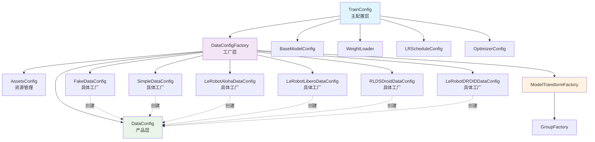
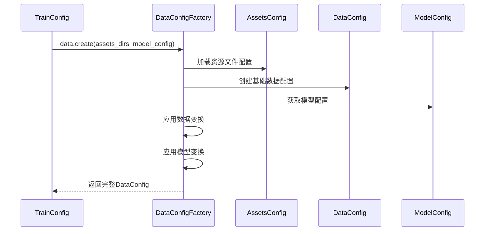

# OpenPI Config.py 配置关系详解

## 🎯 配置类列表和继承关系

### 📋 所有配置类列表

1. **AssetsConfig** - 资源文件配置
2. **DataConfig** - 数据配置
3. **GroupFactory** - 变换组工厂协议
4. **ModelTransformFactory** - 模型变换工厂
5. **DataConfigFactory** - 数据配置工厂抽象基类
6. **FakeDataConfig** - 假数据配置
7. **SimpleDataConfig** - 简单数据配置
8. **LeRobotAlohaDataConfig** - ALOHA数据配置
9. **LeRobotLiberoDataConfig** - LIBERO数据配置
10. **RLDSDroidDataConfig** - RLDS DROID数据配置
11. **LeRobotDROIDDataConfig** - LeRobot DROID数据配置
12. **TrainConfig** - 训练配置

### 🔗 继承关系详解

#### 1. GroupFactory (协议/接口)
```python
class GroupFactory(Protocol):
    def __call__(self, model_config: BaseModelConfig) -> Group:
```
- **作用**：定义变换组工厂的接口
- **继承**：无，这是一个协议(Protocol)
- **被谁继承**：ModelTransformFactory

#### 2. ModelTransformFactory
```python
class ModelTransformFactory(GroupFactory):
```
- **作用**：为不同模型创建变换组
- **继承**：GroupFactory (协议)
- **被谁继承**：无，这是具体实现
- **关系**：被DataConfigFactory使用

#### 3. DataConfigFactory (抽象基类)
```python
class DataConfigFactory(abc.ABC):
    @abc.abstractmethod
    def create(self, assets_dirs, model_config) -> DataConfig:
```
- **作用**：定义创建数据配置的接口
- **继承**：无，这是抽象基类
- **被谁继承**：FakeDataConfig, SimpleDataConfig, LeRobotAlohaDataConfig, LeRobotLiberoDataConfig, RLDSDroidDataConfig, LeRobotDROIDDataConfig
- **包含**：AssetsConfig, DataConfig

#### 4. FakeDataConfig
```python
class FakeDataConfig(DataConfigFactory):
```
- **作用**：创建假数据配置，用于调试
- **继承**：DataConfigFactory
- **被谁继承**：无

#### 5. SimpleDataConfig
```python
class SimpleDataConfig(DataConfigFactory):
```
- **作用**：创建简单数据配置
- **继承**：DataConfigFactory
- **被谁继承**：无

#### 6. LeRobotAlohaDataConfig
```python
class LeRobotAlohaDataConfig(DataConfigFactory):
```
- **作用**：创建ALOHA机器人数据配置
- **继承**：DataConfigFactory
- **被谁继承**：无

#### 7. LeRobotLiberoDataConfig
```python
class LeRobotLiberoDataConfig(DataConfigFactory):
```
- **作用**：创建LIBERO环境数据配置
- **继承**：DataConfigFactory
- **被谁继承**：无

#### 8. RLDSDroidDataConfig
```python
class RLDSDroidDataConfig(DataConfigFactory):
```
- **作用**：创建RLDS格式的DROID数据配置
- **继承**：DataConfigFactory
- **被谁继承**：无

#### 9. LeRobotDROIDDataConfig
```python
class LeRobotDROIDDataConfig(DataConfigFactory):
```
- **作用**：创建LeRobot格式的DROID数据配置
- **继承**：DataConfigFactory
- **被谁继承**：无

#### 10. AssetsConfig
```python
class AssetsConfig:
```
- **作用**：管理资源文件配置
- **继承**：无，独立类
- **被谁继承**：无
- **被谁使用**：DataConfigFactory

#### 11. DataConfig
```python
class DataConfig:
```
- **作用**：定义数据配置的具体内容
- **继承**：无，独立类
- **被谁继承**：无
- **被谁使用**：DataConfigFactory.create()方法返回

#### 12. TrainConfig
```python
class TrainConfig:
```
- **作用**：主训练配置，整合所有其他配置
- **继承**：无，独立类
- **被谁继承**：无
- **包含**：DataConfigFactory, BaseModelConfig, WeightLoader, LRScheduleConfig, OptimizerConfig等

## 🔄 使用关系和工作流程

### 1. 组合关系 (谁包含谁)
- **TrainConfig** 包含：
  - `data: DataConfigFactory` (数据配置工厂)
  - `model: BaseModelConfig` (模型配置)
  - `weight_loader: WeightLoader` (权重加载器)
  - `lr_schedule: LRScheduleConfig` (学习率调度)
  - `optimizer: OptimizerConfig` (优化器配置)

- **DataConfigFactory** 包含：
  - `assets: AssetsConfig` (资源文件配置)
  - `base_config: DataConfig` (基础数据配置)

### 2. 创建关系 (谁创建谁)
```
TrainConfig.data.create() → DataConfig
```
- TrainConfig 调用 DataConfigFactory 的 create() 方法
- DataConfigFactory 创建并返回 DataConfig 实例

### 3. 工作流程
```
1. 用户选择预定义配置 → TrainConfig
2. TrainConfig.data.create() → 调用具体的DataConfigFactory子类
3. DataConfigFactory子类.create() → 创建DataConfig
4. DataConfig → 被训练脚本使用
```

### 4. 具体例子
```python
# 1. 获取预定义配置
config = get_config("pi05_libero")  # 返回 TrainConfig

# 2. 创建数据配置
data_config = config.data.create(  # 调用 LeRobotLiberoDataConfig.create()
    config.assets_dirs,            # 从 TrainConfig 获取
    config.model                   # 从 TrainConfig 获取
)  # 返回 DataConfig

# 3. 使用数据配置进行训练
train_state = init_train_state(config, init_rng, mesh, resume=False)
```

## 📊 配置类层次结构图



## 🔄 配置创建流程图



## 🔧 核心配置类详细说明

### 1. AssetsConfig (资源文件配置)
- **作用**：管理归一化统计信息等资源文件的位置
- **字段**：`assets_dir`(资源文件目录), `asset_id`(资源文件ID)
- **被谁使用**：DataConfigFactory

### 2. DataConfig (数据配置)
- **作用**：定义数据加载和处理的完整管道
- **字段**：`repo_id`(仓库ID), `norm_stats`(归一化统计), `repack_transforms`(重新打包变换), `data_transforms`(数据变换), `model_transforms`(模型变换)
- **被谁使用**：DataConfigFactory.create()方法返回

### 3. DataConfigFactory (数据配置工厂抽象基类)
- **作用**：定义创建数据配置的接口
- **字段**：`repo_id`(仓库ID), `assets`(AssetsConfig), `base_config`(DataConfig)
- **方法**：`create(assets_dirs, model_config) -> DataConfig`
- **被谁继承**：所有具体的数据配置类

### 4. TrainConfig (训练配置)
- **作用**：主训练配置，整合所有其他配置
- **字段**：`name`(配置名称), `model`(模型配置), `data`(数据配置工厂), `weight_loader`(权重加载器), `lr_schedule`(学习率调度), `optimizer`(优化器配置)
- **属性**：`assets_dirs`(资源文件目录), `checkpoint_dir`(检查点目录)
- **被谁使用**：训练脚本的主入口

## 📋 具体数据配置类对比

| 配置类 | 数据集类型 | 主要特点 | 使用场景 |
|--------|------------|----------|----------|
| `FakeDataConfig` | 假数据 | 简单，用于调试 | 测试和调试 |
| `SimpleDataConfig` | 通用 | 自定义变换工厂 | 简单数据集 |
| `LeRobotAlohaDataConfig` | ALOHA | 关节增量动作、空间转换 | ALOHA机器人 |
| `LeRobotLiberoDataConfig` | LIBERO | 图像重新映射、可选增量 | LIBERO环境 |
| `RLDSDroidDataConfig` | DROID RLDS | 大型数据集、高效加载 | 大规模DROID训练 |
| `LeRobotDROIDDataConfig` | DROID LeRobot | 标准格式、关节速度动作 | 小规模DROID训练 |

## 💡 总结

### 核心关系：
1. **TrainConfig** 是主配置，包含所有其他配置组件
2. **DataConfigFactory** 是抽象基类，定义创建数据配置的接口
3. **具体数据配置类** 继承DataConfigFactory，实现特定数据集的配置逻辑
4. **DataConfig** 是工厂生产的产品，包含完整的数据处理管道
5. **AssetsConfig** 管理资源文件，被DataConfigFactory使用

### 工作流程：
```
TrainConfig → DataConfigFactory.create() → DataConfig → 训练脚本使用
```

这个配置系统使用工厂模式和组合模式，为OpenPI提供了灵活、可扩展的配置管理能力。
