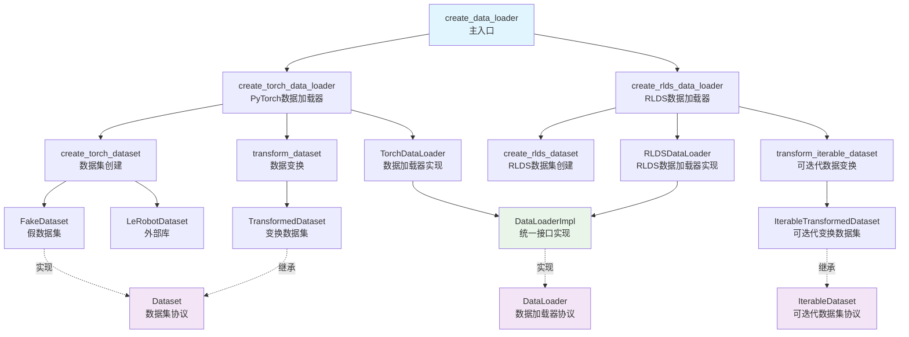

# data_loader.py 类与函数关系总结

## 🎯 总体关系概述

`data_loader.py` 中的类和函数形成了一个**四层架构**，每层有明确的职责：

### 🏗️ 四层架构关系

```
第一层：创建函数层 (Factories) - create_data_loader, create_torch_data_loader等
    ↓ 调用和创建
第二层：实现层 (Implementations) - TorchDataLoader, RLDSDataLoader, DataLoaderImpl
    ↓ 使用和包装
第三层：包装层 (Wrappers) - TransformedDataset, IterableTransformedDataset
    ↓ 实现和继承
第四层：接口层 (Protocols) - Dataset, IterableDataset, DataLoader
```

### 🔗 核心关系说明

1. **创建函数层**：
   - 是数据加载的主要入口
   - 根据配置选择合适的数据加载器类型
   - 协调整个数据加载流程

2. **实现层**：
   - 具体的数据加载器实现
   - 处理实际的批次数据加载
   - 支持不同的框架和分片策略

3. **包装层**：
   - 对原始数据集应用变换
   - 支持链式变换组合
   - 提供统一的变换接口

4. **接口层**：
   - 定义标准的数据集和数据加载器接口
   - 确保类型安全和一致性
   - 支持多态和扩展

## 📋 类和函数列表

### 接口层 (Protocols)
1. **Dataset** - 数据集接口协议
2. **IterableDataset** - 可迭代数据集接口协议
3. **DataLoader** - 数据加载器接口协议

### 包装层 (Wrappers)
4. **TransformedDataset** - 变换数据集包装器
5. **IterableTransformedDataset** - 可迭代变换数据集包装器

### 实现层 (Implementations)
6. **FakeDataset** - 假数据集实现
7. **TorchDataLoader** - PyTorch数据加载器实现
8. **RLDSDataLoader** - RLDS数据加载器实现
9. **DataLoaderImpl** - 数据加载器统一接口实现

### 创建层 (Factories)
10. **create_data_loader** - 主入口函数
11. **create_torch_data_loader** - PyTorch数据加载器创建函数
12. **create_rlds_data_loader** - RLDS数据加载器创建函数
13. **create_torch_dataset** - PyTorch数据集创建函数
14. **create_rlds_dataset** - RLDS数据集创建函数
15. **transform_dataset** - 数据变换函数
16. **transform_iterable_dataset** - 可迭代数据变换函数

### 辅助函数
17. **_collate_fn** - 批次整理函数
18. **_worker_init_fn** - 工作进程初始化函数

## 🔗 继承关系详解

#### 1. Dataset (协议/接口)
```python
class Dataset(Protocol[T_co]):
    def __getitem__(self, index: SupportsIndex) -> T_co:
    def __len__(self) -> int:
```
- **作用**：定义支持随机访问的数据集接口
- **继承**：无，这是一个协议(Protocol)
- **被谁继承**：TransformedDataset, FakeDataset

#### 2. IterableDataset (协议/接口)
```python
class IterableDataset(Protocol[T_co]):
    def __iter__(self) -> Iterator[T_co]:
    def __len__(self) -> int:
```
- **作用**：定义支持迭代访问的数据集接口
- **继承**：无，这是一个协议(Protocol)
- **被谁继承**：IterableTransformedDataset

#### 3. DataLoader (协议/接口)
```python
class DataLoader(Protocol[T_co]):
    def data_config(self) -> DataConfig:
    def __iter__(self) -> Iterator[T_co]:
```
- **作用**：定义数据加载器的标准接口
- **继承**：无，这是一个协议(Protocol)
- **被谁继承**：DataLoaderImpl

#### 4. TransformedDataset
```python
class TransformedDataset(Dataset[T_co]):
```
- **作用**：对原始数据集应用数据变换
- **继承**：Dataset (协议)
- **被谁继承**：无

#### 5. IterableTransformedDataset
```python
class IterableTransformedDataset(IterableDataset[T_co]):
```
- **作用**：对可迭代数据集应用数据变换
- **继承**：IterableDataset (协议)
- **被谁继承**：无

#### 6. FakeDataset
```python
class FakeDataset(Dataset):
```
- **作用**：生成假数据用于测试和调试
- **继承**：Dataset (协议)
- **被谁继承**：无

#### 7. TorchDataLoader
```python
class TorchDataLoader:
```
- **作用**：基于PyTorch的数据加载器实现
- **继承**：无，独立类
- **被谁继承**：无
- **被谁使用**：DataLoaderImpl

#### 8. RLDSDataLoader
```python
class RLDSDataLoader:
```
- **作用**：基于RLDS的数据加载器实现
- **继承**：无，独立类
- **被谁继承**：无
- **被谁使用**：DataLoaderImpl

#### 9. DataLoaderImpl
```python
class DataLoaderImpl(DataLoader):
```
- **作用**：数据加载器接口的具体实现
- **继承**：DataLoader (协议)
- **被谁继承**：无
- **包含**：TorchDataLoader或RLDSDataLoader

## 🔄 使用关系和工作流程

### 1. 创建关系 (谁创建谁)
```
create_data_loader() → create_torch_data_loader() / create_rlds_data_loader()
create_torch_data_loader() → TorchDataLoader → DataLoaderImpl
create_rlds_data_loader() → RLDSDataLoader → DataLoaderImpl
```

### 2. 包装关系 (谁包装谁)
```
TransformedDataset 包装 Dataset
IterableTransformedDataset 包装 IterableDataset
DataLoaderImpl 包装 TorchDataLoader / RLDSDataLoader
```

### 3. 工作流程
```
1. 用户调用 create_data_loader() → 选择数据加载器类型
2. 创建底层数据加载器 → TorchDataLoader 或 RLDSDataLoader
3. 包装成统一接口 → DataLoaderImpl
4. 返回给训练脚本使用
```

### 4. 具体例子
```python
# 1. 创建数据加载器
data_loader = create_data_loader(config, sharding=sharding, framework="jax")
# 内部调用：create_torch_data_loader() → TorchDataLoader → DataLoaderImpl

# 2. 在训练循环中使用
for batch in data_loader:  # 调用 DataLoaderImpl.__iter__()
    observation, actions = batch  # 格式化的观察和动作数据
```

## 📊 类和函数关系图



## 🔧 核心类和函数详细说明

### 1. create_data_loader() - 主入口函数
- **作用**：根据配置创建合适的数据加载器
- **输入**：TrainConfig, 分片配置, 框架类型等
- **输出**：DataLoaderImpl
- **调用**：create_torch_data_loader() 或 create_rlds_data_loader()

### 2. create_torch_data_loader() - PyTorch数据加载器创建
- **作用**：创建基于PyTorch的数据加载器
- **输入**：数据配置, 模型配置, 批次大小等
- **输出**：DataLoaderImpl
- **调用**：create_torch_dataset(), transform_dataset(), TorchDataLoader()

### 3. create_rlds_data_loader() - RLDS数据加载器创建
- **作用**：创建基于RLDS的数据加载器
- **输入**：数据配置, 动作序列长度, 批次大小等
- **输出**：DataLoaderImpl
- **调用**：create_rlds_dataset(), transform_iterable_dataset(), RLDSDataLoader()

### 4. TorchDataLoader - PyTorch数据加载器实现
- **作用**：基于PyTorch的数据加载器实现
- **输入**：数据集, 批次大小, 分片配置等
- **输出**：批次数据迭代器
- **特点**：支持多进程, 分布式训练, JAX分片

### 5. RLDSDataLoader - RLDS数据加载器实现
- **作用**：基于RLDS的数据加载器实现
- **输入**：DROID数据集, 分片配置
- **输出**：批次数据迭代器
- **特点**：轻量级包装, 专门处理RLDS格式

### 6. DataLoaderImpl - 统一接口实现
- **作用**：数据加载器接口的具体实现
- **输入**：数据配置, 底层数据加载器
- **输出**：格式化的观察和动作数据
- **特点**：统一接口, 格式转换

## 💡 总结

### 核心关系：
1. **create_data_loader** 是主入口，根据配置选择数据加载器类型
2. **create_torch_data_loader** 和 **create_rlds_data_loader** 是具体的创建函数
3. **TorchDataLoader** 和 **RLDSDataLoader** 是底层实现
4. **DataLoaderImpl** 是统一接口，包装底层实现
5. **TransformedDataset** 和 **IterableTransformedDataset** 提供数据变换功能

### 工作流程：
```
create_data_loader() → 选择类型 → 创建底层加载器 → 包装成统一接口 → 返回给训练脚本
```

### 设计模式：
- **工厂模式**：创建函数根据配置创建不同类型的数据加载器
- **包装器模式**：TransformedDataset包装原始数据集，DataLoaderImpl包装底层加载器
- **策略模式**：支持PyTorch和JAX两种框架
- **协议模式**：使用Protocol定义接口，确保类型安全

这个架构设计清晰，层次分明，每个组件都有明确的职责和接口，支持多种数据源和框架。
