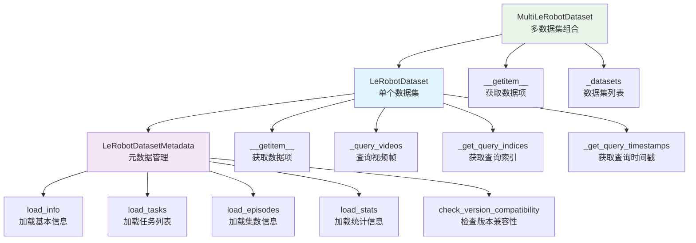

# lerobot_dataset.py 类与函数关系总结

## 🎯 总体关系概述

`lerobot_dataset.py` 中的类和函数形成了一个**三层架构**，每层有明确的职责：

### 🏗️ 三层架构关系

```
第一层：数据集类层 - LeRobotDataset, MultiLeRobotDataset
    ↓ 使用和依赖
第二层：元数据管理层 - LeRobotDatasetMetadata
    ↓ 调用和加载
第三层：工具函数层 - 各种加载、验证、处理函数
```

### 🔗 核心关系说明

1. **数据集类层**：
   - 是PyTorch Dataset的实现，提供数据加载接口
   - 支持单个数据集和多个数据集的组合
   - 处理数据变换、时间戳同步、视频解码等

2. **元数据管理层**：
   - 负责管理数据集的元数据（信息、任务、统计等）
   - 处理版本兼容性和远程下载
   - 提供数据集的基本信息和查询接口

3. **工具函数层**：
   - 提供各种辅助功能（加载、验证、处理等）
   - 支持数据集的创建、转换、验证等操作
   - 处理图像、视频、统计信息等

## 📋 类和函数列表

### 数据集类层
1. **LeRobotDataset** - 单个LeRobot数据集实现
2. **MultiLeRobotDataset** - 多个LeRobot数据集组合实现

### 元数据管理层
3. **LeRobotDatasetMetadata** - 数据集元数据管理类

### 工具函数层
4. **load_info** - 加载数据集基本信息
5. **load_tasks** - 加载任务列表
6. **load_episodes** - 加载集数信息
7. **load_stats** - 加载统计信息
8. **load_episodes_stats** - 加载集数统计信息
9. **aggregate_stats** - 聚合统计信息
10. **backward_compatible_episodes_stats** - 向后兼容的集数统计
11. **check_version_compatibility** - 检查版本兼容性
12. **get_safe_version** - 获取安全版本
13. **is_valid_version** - 验证版本有效性
14. **validate_frame** - 验证数据帧
15. **validate_episode_buffer** - 验证集数缓冲区
16. **check_timestamps_sync** - 检查时间戳同步
17. **check_delta_timestamps** - 检查增量时间戳
18. **get_delta_indices** - 获取增量索引
19. **get_episode_data_index** - 获取集数数据索引
20. **write_image** - 写入图像文件
21. **encode_video_frames** - 编码视频帧
22. **decode_video_frames** - 解码视频帧

### 重要方法层
23. **LeRobotDatasetMetadata.__init__** - 元数据管理器初始化
24. **LeRobotDatasetMetadata.load_metadata** - 加载元数据
25. **LeRobotDatasetMetadata.pull_from_repo** - 从远程下载
26. **LeRobotDatasetMetadata.save_episode** - 保存集数信息
27. **LeRobotDatasetMetadata.add_task** - 添加任务
28. **LeRobotDataset.__init__** - 数据集初始化
29. **LeRobotDataset.__getitem__** - 获取数据项
30. **LeRobotDataset.load_hf_dataset** - 加载HuggingFace数据集
31. **LeRobotDataset._get_query_indices** - 获取查询索引
32. **LeRobotDataset._query_videos** - 查询视频帧
33. **MultiLeRobotDataset.__init__** - 多数据集初始化
34. **MultiLeRobotDataset.__getitem__** - 多数据集获取数据项

## 🔗 继承关系详解

#### 1. LeRobotDataset
```python
class LeRobotDataset(torch.utils.data.Dataset):
```
- **作用**：单个LeRobot数据集的PyTorch Dataset实现
- **继承**：torch.utils.data.Dataset
- **被谁继承**：无
- **包含**：LeRobotDatasetMetadata实例

#### 2. MultiLeRobotDataset
```python
class MultiLeRobotDataset(torch.utils.data.Dataset):
```
- **作用**：多个LeRobot数据集的组合实现
- **继承**：torch.utils.data.Dataset
- **被谁继承**：无
- **包含**：多个LeRobotDataset实例

#### 3. LeRobotDatasetMetadata
```python
class LeRobotDatasetMetadata:
```
- **作用**：数据集元数据管理类
- **继承**：无，独立类
- **被谁继承**：无
- **被谁使用**：LeRobotDataset

## 🔄 使用关系和工作流程

### 1. 创建关系 (谁创建谁)
```
LeRobotDataset.__init__() → LeRobotDatasetMetadata()
MultiLeRobotDataset.__init__() → 多个LeRobotDataset()
```

### 2. 依赖关系 (谁依赖谁)
```
LeRobotDataset 依赖 LeRobotDatasetMetadata
MultiLeRobotDataset 依赖 多个LeRobotDataset
LeRobotDatasetMetadata 依赖 各种工具函数
```

### 3. 工作流程
```
1. 创建数据集 → LeRobotDataset 或 MultiLeRobotDataset
2. 初始化元数据 → LeRobotDatasetMetadata
3. 加载数据 → 从本地或远程加载
4. 获取数据项 → __getitem__ 方法
5. 处理数据 → 应用变换、解码视频等
```

### 4. 具体例子
```python
# 1. 创建单个数据集
dataset = LeRobotDataset("physical-intelligence/libero")
# 内部创建：LeRobotDatasetMetadata("physical-intelligence/libero")

# 2. 创建多数据集
multi_dataset = MultiLeRobotDataset(["dataset1", "dataset2"])
# 内部创建：多个LeRobotDataset实例

# 3. 获取数据项
item = dataset[0]  # 调用LeRobotDataset.__getitem__()
# 内部调用：meta.load_metadata(), _query_videos()等
```

## 📊 类和函数关系图



## 🔧 核心类和函数详细说明

### 1. LeRobotDataset - 单个数据集实现
- **作用**：LeRobot数据集的PyTorch Dataset实现
- **输入**：仓库ID、根目录、集数列表等
- **输出**：PyTorch Dataset接口
- **特点**：支持图像、视频、时间戳同步、数据变换

### 2. MultiLeRobotDataset - 多数据集组合
- **作用**：将多个LeRobot数据集组合成统一数据集
- **输入**：仓库ID列表、根目录等
- **输出**：统一的PyTorch Dataset接口
- **特点**：自动处理特征差异、添加数据集索引标识

### 3. LeRobotDatasetMetadata - 元数据管理
- **作用**：管理数据集的元数据信息
- **输入**：仓库ID、根目录、版本等
- **输出**：元数据管理接口
- **特点**：版本兼容性、远程下载、统计信息管理

### 4. __getitem__ - 数据项获取
- **作用**：根据索引获取数据项
- **输入**：数据项索引
- **输出**：包含观察、动作、任务等的数据字典
- **特点**：支持增量时间戳、视频解码、图像变换

## 💡 总结

### 核心关系：
1. **LeRobotDataset** 是主要的数据集类，继承自PyTorch Dataset
2. **MultiLeRobotDataset** 是多个数据集的组合，提供统一接口
3. **LeRobotDatasetMetadata** 是元数据管理器，被数据集类使用
4. **工具函数层** 提供各种辅助功能，被元数据管理器使用

### 工作流程：
```
创建数据集 → 初始化元数据 → 加载数据 → 获取数据项 → 处理数据
```

### 设计模式：
- **组合模式**：MultiLeRobotDataset组合多个LeRobotDataset
- **依赖注入**：LeRobotDataset依赖LeRobotDatasetMetadata
- **模板方法**：__getitem__方法定义数据获取流程
- **策略模式**：支持不同的图像变换和视频解码策略

这个架构设计清晰，层次分明，每个组件都有明确的职责和接口，支持机器人学习数据的加载、处理和组合。
