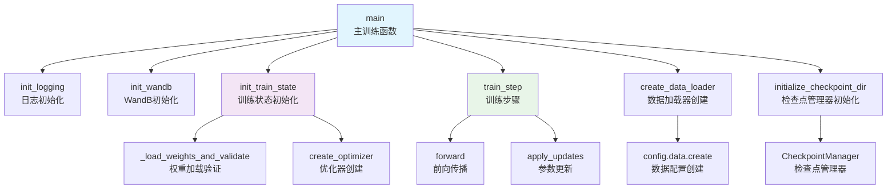

# train.py 函数与模块关系总结

## 🎯 总体关系概述

`train.py` 中的函数和模块形成了一个**分层架构**，每层有明确的职责：

### 🏗️ 分层架构关系

```
第一层：主入口层 - main函数，协调整个训练流程
    ↓ 调用和协调
第二层：初始化层 - init_logging, init_wandb, init_train_state
    ↓ 使用和配置
第三层：工具层 - _load_weights_and_validate, train_step
    ↓ 依赖和调用
第四层：外部模块层 - config, data_loader, checkpoints, optimizer等
```

### 🔗 核心关系说明

1. **main函数**：
   - 是训练脚本的核心协调者
   - 按顺序调用各个初始化函数
   - 管理整个训练流程

2. **初始化函数层**：
   - 负责各种组件的初始化
   - 包括日志、实验跟踪、训练状态等

3. **工具函数层**：
   - 提供具体的功能实现
   - 如权重加载、训练步骤等

4. **外部模块层**：
   - 提供各种服务和功能
   - 如配置管理、数据加载、检查点等

## 📋 函数和模块列表

### 主入口层
1. **main** - 主训练函数

### 初始化层
2. **init_logging** - 初始化日志记录
3. **init_wandb** - 初始化WandB实验跟踪
4. **init_train_state** - 初始化训练状态

### 工具层
5. **_load_weights_and_validate** - 加载并验证权重
6. **train_step** - 训练步骤函数

### 外部模块层
7. **_config** - 配置管理模块
8. **_data_loader** - 数据加载模块
9. **_checkpoints** - 检查点管理模块
10. **_optimizer** - 优化器模块
11. **sharding** - 分片管理模块
12. **training_utils** - 训练工具模块
13. **_weight_loaders** - 权重加载模块

## 🔗 调用关系详解

#### 1. main() - 主训练函数
```python
def main(config: _config.TrainConfig):
```
- **作用**：协调整个训练流程
- **调用**：init_logging(), init_wandb(), init_train_state(), train_step()
- **被谁调用**：程序入口点

#### 2. init_logging() - 日志初始化
```python
def init_logging():
```
- **作用**：设置自定义日志格式
- **调用**：无
- **被谁调用**：main()

#### 3. init_wandb() - WandB初始化
```python
def init_wandb(config, resuming, log_code, enabled):
```
- **作用**：初始化实验跟踪系统
- **调用**：wandb.init()
- **被谁调用**：main()

#### 4. init_train_state() - 训练状态初始化
```python
def init_train_state(config, init_rng, mesh, resume):
```
- **作用**：创建训练状态和分片策略
- **调用**：_optimizer.create_optimizer(), _load_weights_and_validate()
- **被谁调用**：main()

#### 5. _load_weights_and_validate() - 权重加载
```python
def _load_weights_and_validate(loader, params_shape):
```
- **作用**：加载并验证预训练权重
- **调用**：loader.load()
- **被谁调用**：init_train_state()

#### 6. train_step() - 训练步骤
```python
def train_step(config, train_rng, train_state, batch):
```
- **作用**：执行单步训练
- **调用**：_model.forward(), optax.apply_updates()
- **被谁调用**：main()中的训练循环

## 🔄 工作流程关系

### 1. 初始化流程
```
main() → init_logging() → 设置日志格式
main() → init_wandb() → 初始化实验跟踪
main() → init_train_state() → 创建训练状态
```

### 2. 训练流程
```
main() → 创建数据加载器 → 训练循环 → train_step() → 保存检查点
```

### 3. 数据流
```
配置 → 数据加载器 → 训练状态 → 训练步骤 → 检查点
```

## 📊 函数调用关系图



## 🔧 核心函数详细说明

### 1. main() - 主训练函数
- **作用**：协调整个训练流程
- **输入**：TrainConfig配置对象
- **输出**：无（执行训练）
- **调用**：所有其他函数

### 2. init_train_state() - 训练状态初始化
- **作用**：创建训练状态和分片策略
- **输入**：配置、随机数、网格、恢复标志
- **输出**：训练状态和分片信息
- **调用**：优化器创建、权重加载

### 3. train_step() - 训练步骤
- **作用**：执行单步训练（前向传播、反向传播、参数更新）
- **输入**：配置、随机数、训练状态、批次数据
- **输出**：更新后的训练状态和训练指标
- **调用**：模型前向传播、优化器更新

### 4. _load_weights_and_validate() - 权重加载
- **作用**：加载并验证预训练权重
- **输入**：权重加载器、参数形状
- **输出**：验证后的权重参数
- **调用**：权重加载器的load方法

## 💡 总结

### 核心关系：
1. **main函数** 是主协调者，按顺序调用各个初始化函数
2. **初始化函数层** 负责各种组件的初始化
3. **工具函数层** 提供具体的功能实现
4. **外部模块层** 提供各种服务和功能

### 工作流程：
```
配置解析 → 初始化 → 数据加载 → 训练循环 → 检查点保存
```

### 设计模式：
- **主函数模式**：main函数作为程序入口和协调者
- **分层架构**：不同层次的函数负责不同的职责
- **依赖注入**：通过参数传递配置和依赖
- **模块化设计**：每个函数都有明确的职责和接口

这个架构设计清晰，层次分明，每个函数都有明确的职责和调用关系，便于理解和维护。
